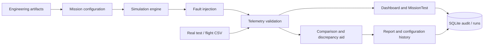

# Architecture

The FastAPI application is deliberately split into small services: `simulator.py`, `telemetry.py`, `comparison.py`, `ork.py`, and `security.py`. `main.py` composes those services into documented endpoints. Source artifact content is never overwritten. SQLite is appropriate for a one-machine prototype; a collaborative deployment would replace it with PostgreSQL plus authentication and authorization.

The simulator is deterministic when given the same scenario and seed. It generates synthetic, bounded values for testing software pipelines, not high-fidelity aerodynamic prediction.
